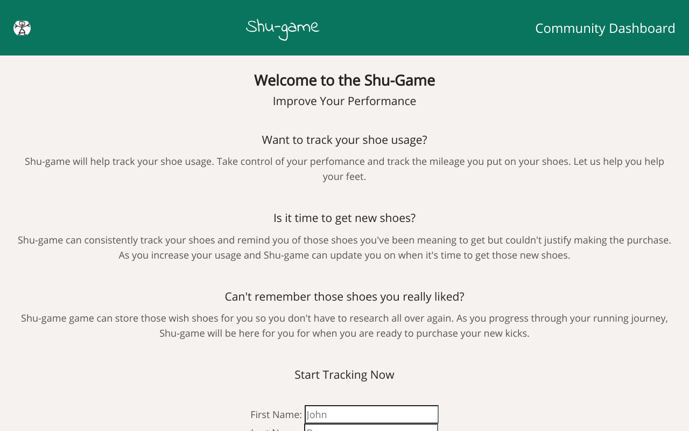

The name of your app at the top of the file.
A link to your live app.
Documentation of your API.
Screenshot(s) of your app. This makes your app description much easier to understand.
A summary section. This should have a concise explanation of what your app does. Try to frame this from the standpoint of what the user does, or what the app enables for the user.
A section on the technology used.

App Name: Shu-game
Live Link: https://shugame-app.now.sh/

Shu-game can help users track their usage of their running shoes and hold their list of wish list item for those shoes they wish to purchase when it's time. 

Technologies Used: React, CSS, JS
